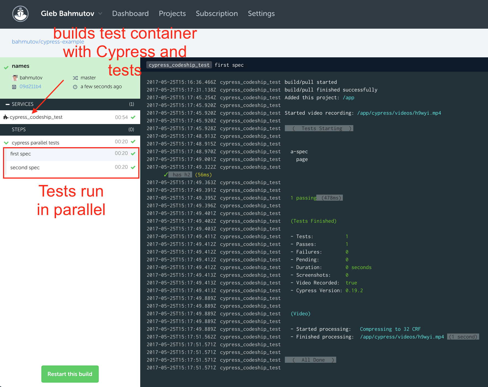

# cypress-example

> Running Cypress tests on CodeshipCI example

Any CI that supports Docker images should be able to run Cypress tests.
For example this repo runs on [Codeship Pro](https://codeship.com/features/pro)
by specifying a full base Docker image we have created at Cypress with
the testing tool pre-installed
[cypress/internal](https://hub.docker.com/r/cypress/internal/) or you can grab
just [cypress/base](https://hub.docker.com/r/cypress/base/) and install
Cypress yourself.

See Codeship configuration files [codeship-services.yml](codeship-services.yml)
and [codeship-steps.yml](codeship-steps.yml) for actual commands. We need
to build an image with Cypress and our sources and tests. This is done
by the [Dockerfile](./Dockerfile), and the individual specs are executed
in parallel. The final result - very fast execution of e2e tests!

